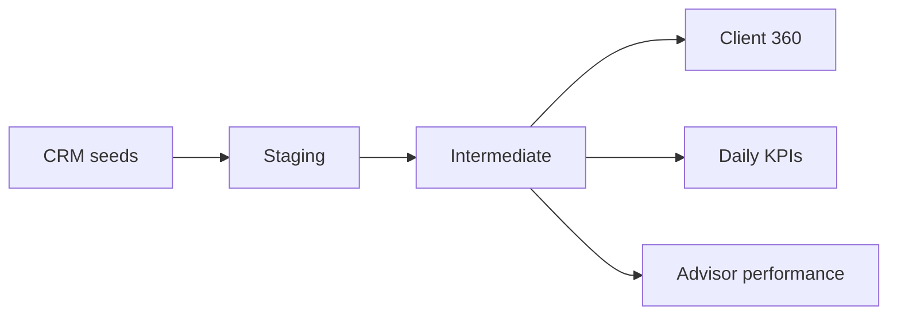

# Client Analytics Data Mart

A dbt analytics project that turns CRM, account, interaction, and transaction data into tested PostgreSQL reporting models. It centralizes client KPIs so analysts and dashboards use the same definitions.

## Highlights

- 16 modular SQL models across staging, intermediate, and mart layers
- Automated integrity, uniqueness, accepted-value, and null tests
- Four governed KPIs: active clients, assets under management, net flow, and engagement rate
- Incremental fact models and documented lineage
- Seeds for a reproducible local demonstration

## Lineage



## Model layers

| Layer | Purpose |
|---|---|
| `staging` | Rename, cast, and standardize source data |
| `intermediate` | Reusable business logic and entity joins |
| `marts` | Reporting-ready facts, dimensions, and KPI tables |

## Quick start with PostgreSQL

```bash
cp .env.example .env
docker compose up -d
python -m venv .venv
source .venv/bin/activate
pip install -r requirements.txt
export DBT_PROFILES_DIR="$PWD"
dbt seed
dbt build
dbt docs generate
dbt docs serve
```

## Governed KPI definitions

| KPI | Definition |
|---|---|
| Active clients | Distinct clients with `status = 'active'` |
| AUM | Latest account balance summed across open accounts |
| Net flow | Deposits minus withdrawals for the reporting period |
| Engagement rate | Active clients with an interaction in 30 days / active clients |

The sample data is intentionally small. The same SQL structure runs against PostgreSQL source tables in production-like environments.

## Validation

`dbt build` executes all models and tests. CI starts PostgreSQL, loads seeds, builds the DAG, and fails on any data-quality violation.

## License

MIT
